# WAPH-Web Application Programming and Hacking

## Instructor: Dr. Phu Phung

# Project Topic/Title: A MINI FACEBOOK

# Team members

1. Jaya Surya Ramisetty, ramiseja@mail.uc.edu
2. Karthik Pavuluri, pavulukk@mail.uc.edu
3. Purna Lokesh Reddy Chimalamarri, chimalpy@mail.uc.edu
4. Chakravarthi Maddi, maddici@mail.uc.edu

# Project Management Information

Source code repository (private access): (https://github.com/waph-team21/waph-teamproject.git)

Project homepage (public): (https://github.com/waph-team21/waph-team21.github.io.git)

# Implementation and demos:

- Anyone can register for an account: 

- Logged-in users can:

- login:
  

- Change password:
  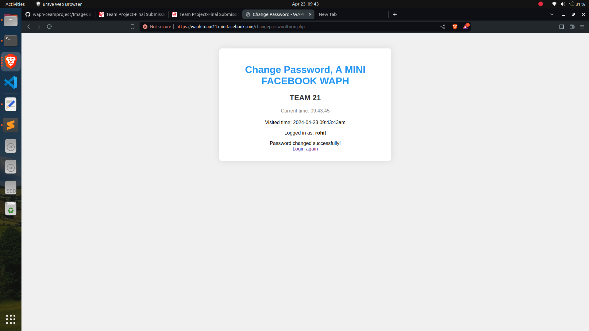

-Add a new post:
 
 
 
- Edit their own posts:
   
  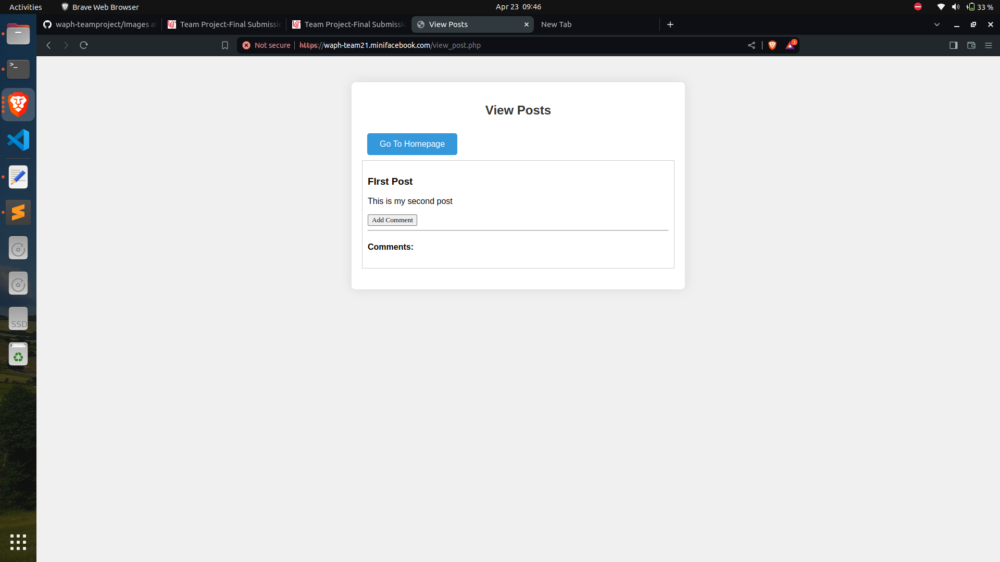

- Delete their own posts:
 

-Add comments on any post, e.g, by their own or others:
  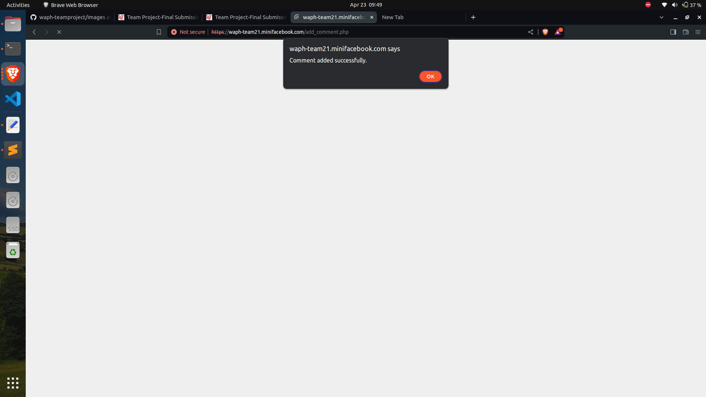
  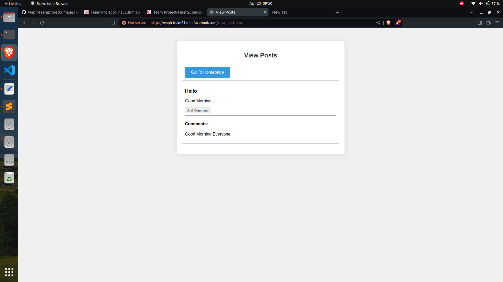

-Can have real-time chat with others*:
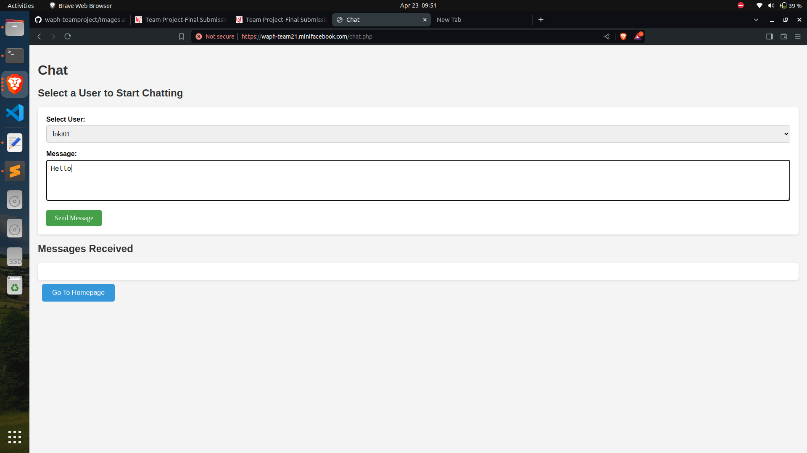
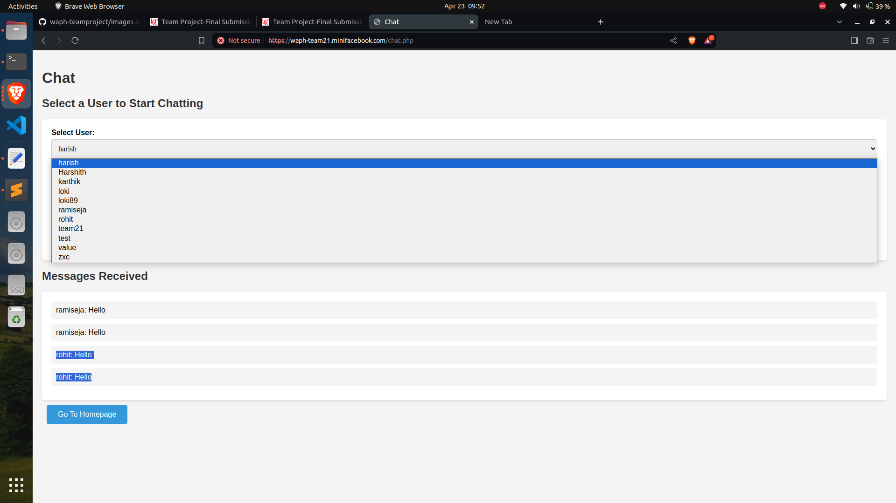

- Superusers can:
- Login (with the account added directly in the database):
  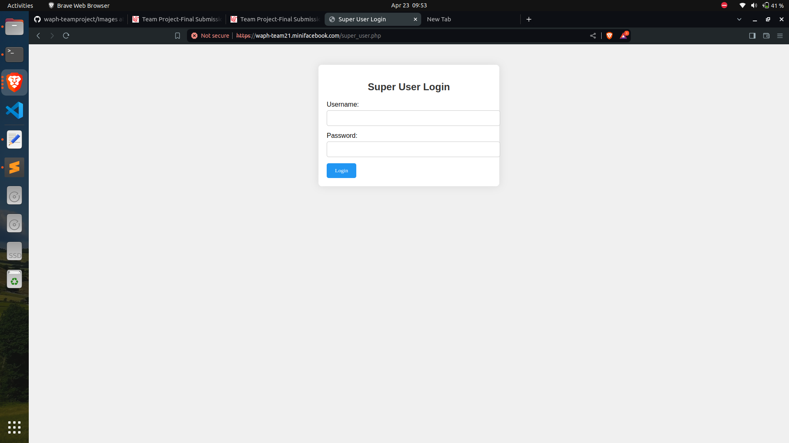
  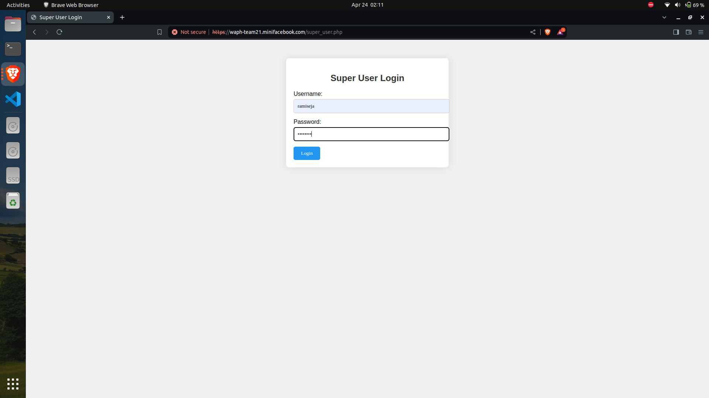
  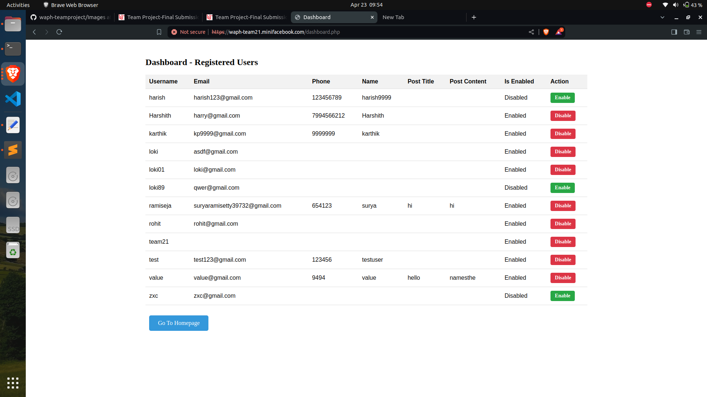

-View the list of registered users.:

-Disable (not delete) a registered user*:
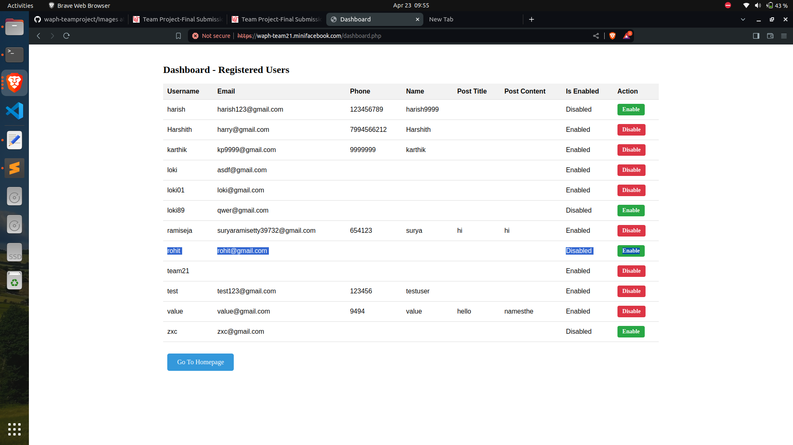

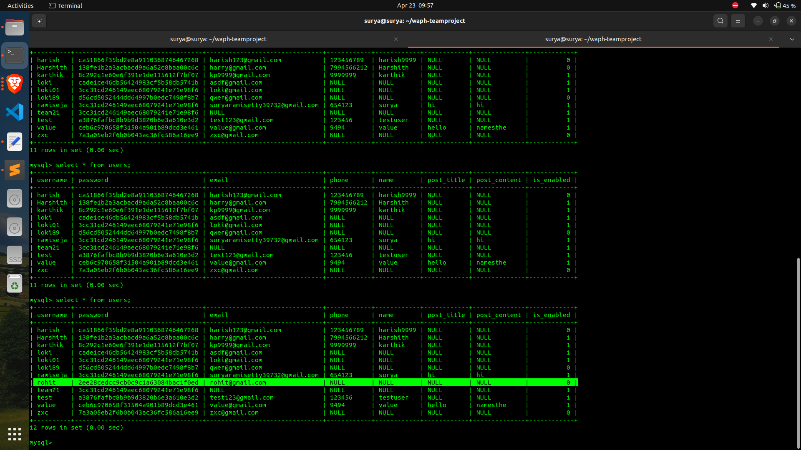
-Enable a registered user*:

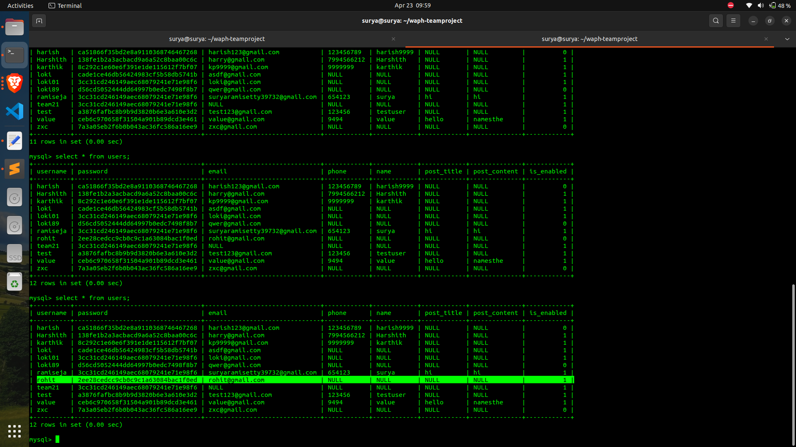
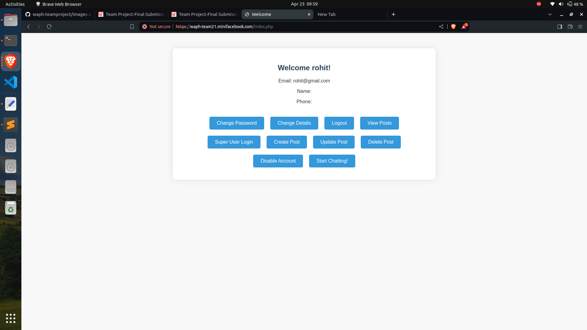
